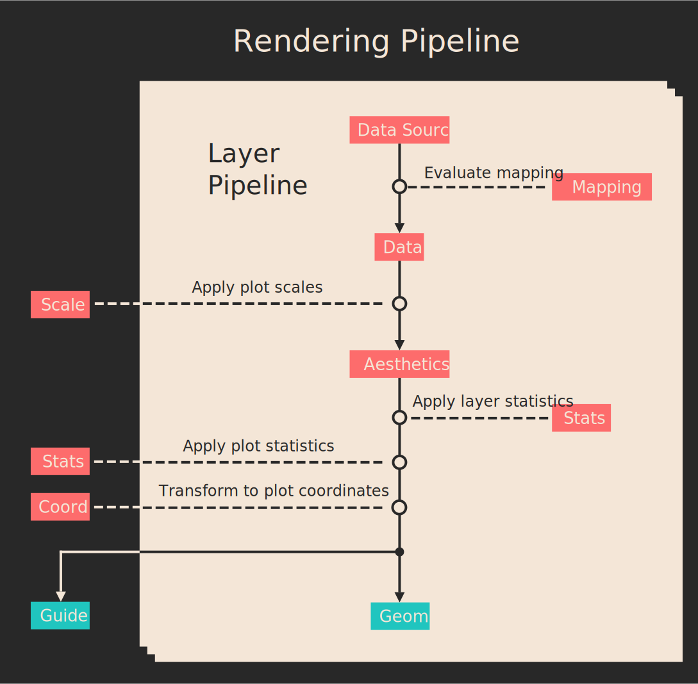

```@meta
Author = "Darwin Darakananda"
```
# Rendering Pipeline

```@setup 1
using DataFrames
using Colors
using Compose
using RDatasets
using Showoff
using Gadfly
```

How does the function call

```julia
df = dataset("ggplot2", "diamonds")
p = plot(df,
         x = :Price, color = :Cut,
		 Stat.histogram,
		 Geom.bar)
```

actually get turned into the following plot?

```@setup 1
df = dataset("ggplot2", "diamonds")
p = plot(df,
         x = :Price, color = :Cut,
		 Stat.histogram,
		 Geom.bar)
```

```@example 1
p # hide
```

The rendering pipeline transforms a plot specification into a [Compose](http://www.composejl.org) scene graph that contains a set of guides (e.g. axis ticks, color keys) and one or more layers of geometry (e.g. points, lines).
The specification of each layer has

- a **data source** (e.g. `dataset("ggplot2", "diamonds")`)
- a **geometry** to represent the layer's data (e.g. point, line, etc.)
- **mappings** to associate aesthetics of the geometry with elements of the data source (e.g.  `:color => :Cut`)
- layer-wise **statistics** (optional) to be applied to the layer's data

All layers of a plot share the same

- [Coordinates](@ref) for the geometry (e.g. cartesian, polar, etc.)
- axis [Scales](@ref) (e.g. loglog, semilog, etc.)
- plot-wise [Statistics](@ref) (optional) to be applied to all layers
- [Guides](@ref)

A full plot specification must describe these shared elements as well as all the layer specifications.
In the example above, we see that only the data source, statistics, geometry, and mapping are specified.
The missing elements are either inferred from the data (e.g. categorical values in `df[:Cut]` implies a discrete color scale), or assumed using defaults (e.g. continuous x-axis scale).
For example, invoking `plot` with all the elements will look something like

```julia
p = plot(layer(df,
               x = :Price, color = :Cut,
		       Stat.histogram,
		       Geom.bar),
	  	 Scale.x_continuous,
		 Scale.color_discrete,
		 Coord.cartesian,
		 Guide.xticks, Guide.yticks,
		 Guide.xlabel("Price"),
		 Guide.colorkey("Cut"))
```

Once a full plot specification is filled out, the rendering process proceeds as follows:



1. For each layer in the plot, we first map subsets of the data source to a `Data` object. The `Price` and `Cut` columns of the `diamond` dataset are mapped to the `:x` and `:color` fields of `Data`, respectively.

2. Scales are applied to the data to obtain plottable aesthetics. [Scale.x_continuous](@ref) keeps the values of `df[:Price]` unchanged, while [Scale.color_discrete_hue](@ref) maps the unique elements of `df[:Cut]` (an array of strings) to actual color values.

3. The aesthetics are transformed by layer-wise and plot-wise statistics, in order. [Stat.histogram](@ref) replaces the `x` field of the aesthetics with bin positions, and sets the `y` field with the corresponding counts.

4. Using the position aesthetics from all layers, we create a Compose context with a coordinate system that fits the data to screen coordinates. [Coord.cartesian](@ref) creates a Compose context that maps a vertical distance of `3000` counts to about two inches in the rendered plot.

5. Each layer renders its own geometry.

6. Finally, we compute the layout of the guides and render them on top of the plot context.
